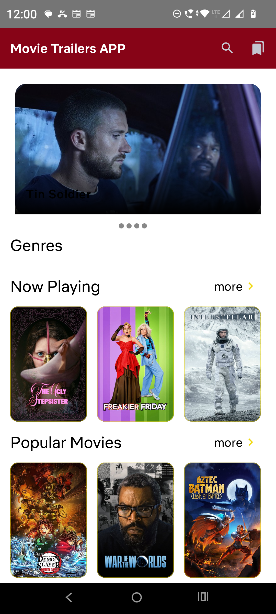
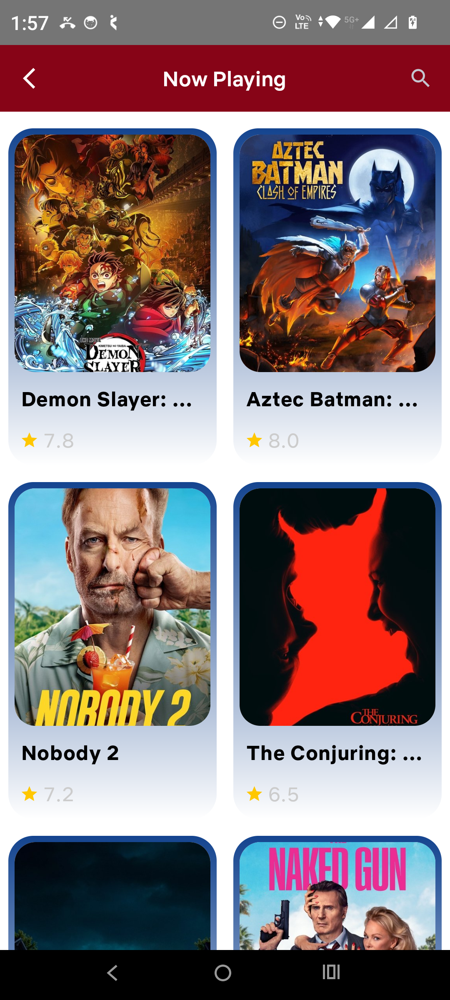
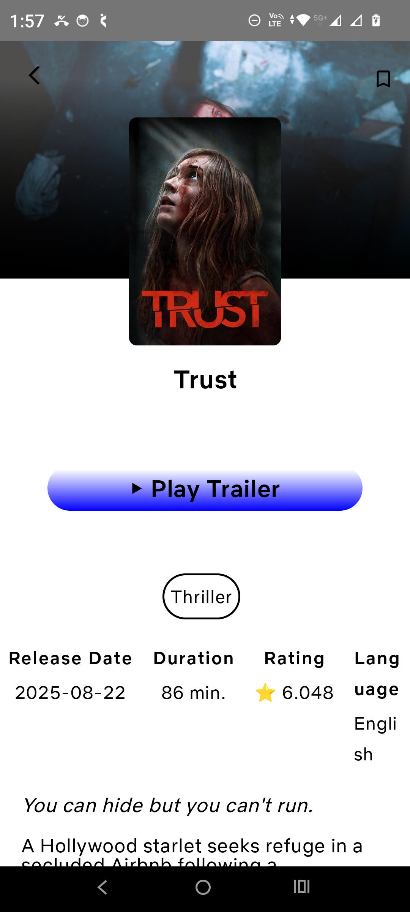

# MovieApp
A modern Android app leveraging TMDB API to browse movies, view details, watch trailers via ExoPlayer, and manage a personal watchlist. Built with MVVM Clean Architecture, Jetpack Compose, Retrofit+OkHttp, Room, and other Jetpack components.

### 🛠️ Tech Stack

- 🎨 **Jetpack Compose** – Modern declarative UI toolkit  
- 🧩 **MVVM Architecture** – Clean and testable separation of concerns  
- 🏗️ **Dagger Hilt** – Dependency injection for scalable and maintainable code  
- 🌐 **Retrofit** – Networking layer for consuming REST APIs  
- 🗂️ **Room Database** – Local persistence (e.g., Watchlist feature)  
- 📑 **Paging 3** – Efficient handling of large data sets with pagination  
- 🎬 **ExoPlayer** – Smooth trailer and video playback  
- 🖼️ **Coil** – Lightweight and fast image loading library  
- 🧭 **Navigation Compose** – Intuitive and seamless in-app navigation

 
 ### 🚀 Features

- 🎞️ **Home Screen** – Browse latest movies, genres, and featured banners  
- 🔍 **Search** – Quickly find movies by title  
- 🎬 **Movie Details**  
  - 📝 Title, overview, release date, and rating  
  - 👥 Cast information with profile photos  
  - 🎥 Similar movie suggestions  
  - ▶️ Watch official trailers with ExoPlayer  
- ❤️ **Watchlist** – Add or remove movies using Room Database  
- ⚡ **Infinite Scrolling** – Smooth pagination powered by Paging 3  
- 🎨 **Modern UI** – Built with Jetpack Compose for responsive design

###  📷 Screenshots and Video
## 📸 Screenshots

_Screenshots of app_

| Home | Now Playing | Details | Videos |
|--------------|-------------|----------------|--------|
|  |  |  |  |

---

